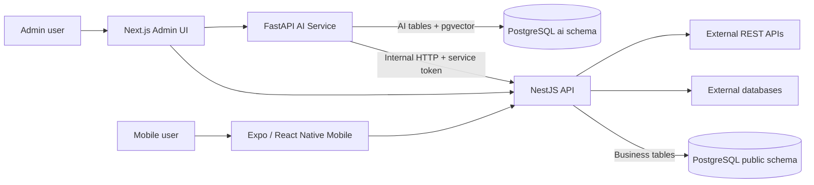
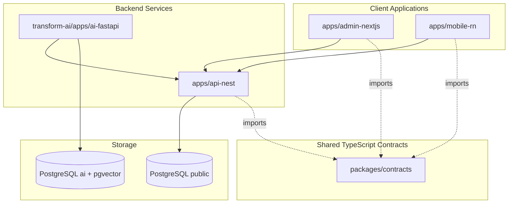
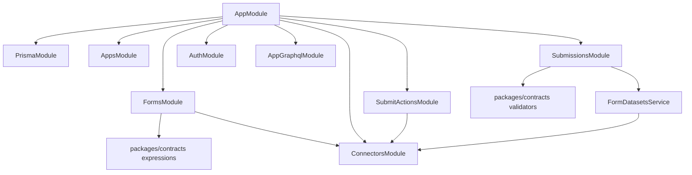
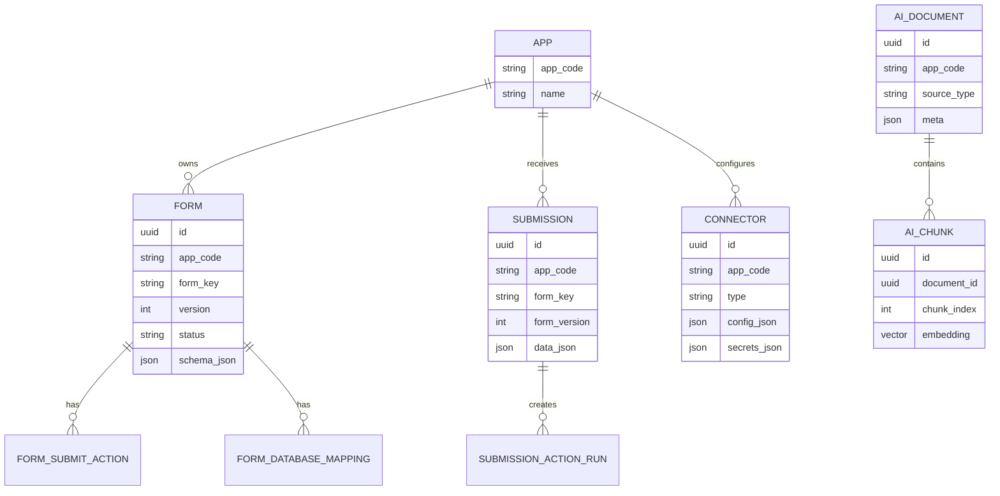
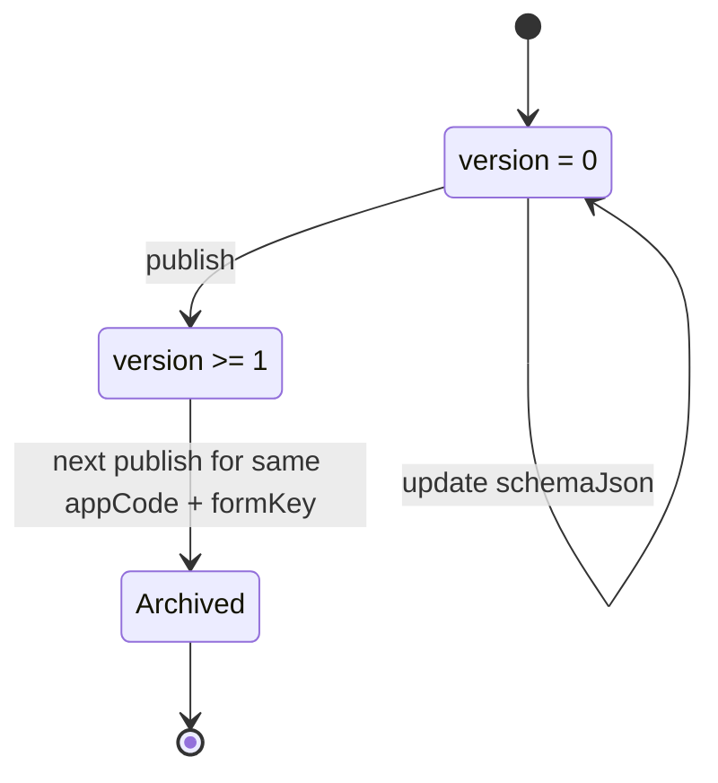
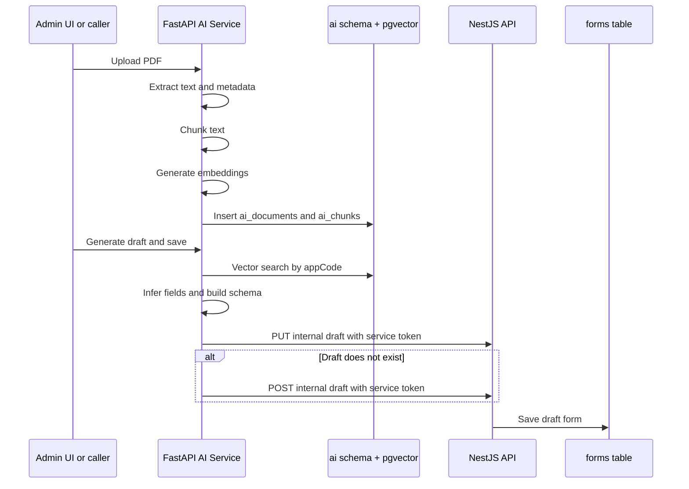
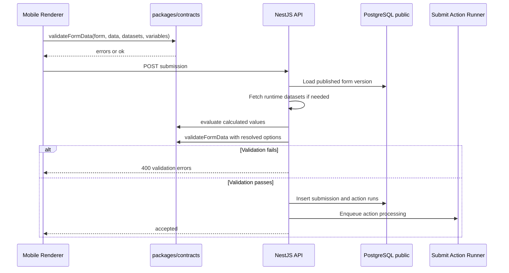
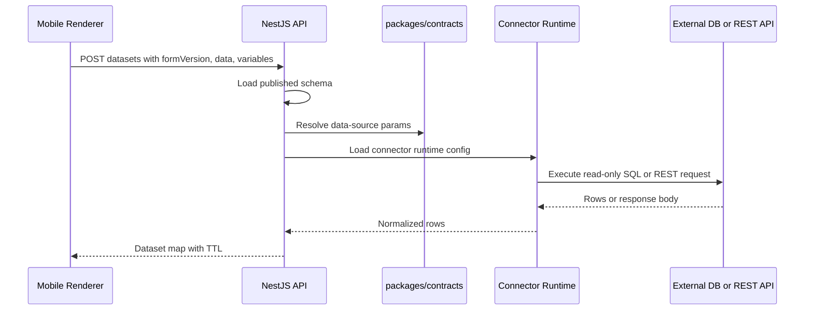

# Architecture Diagrams

These diagrams use Mermaid and should render in GitHub-style Markdown viewers.

## System Context

## Container Diagram

## NestJS Module View

## Data Ownership

Note: `APP`, `FORM`, `SUBMISSION`, `CONNECTOR`, and submit-action tables are
Nest-owned Prisma tables in `public`. `AI_DOCUMENT` and `AI_CHUNK` represent
FastAPI-owned SQLAlchemy tables in the `ai` schema.

## Form Lifecycle

## AI Ingestion And Draft Save

## Submission Validation

## Runtime Data Source Fetch

